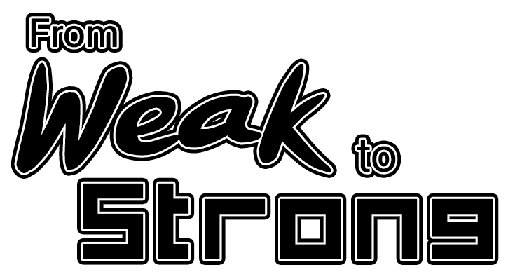
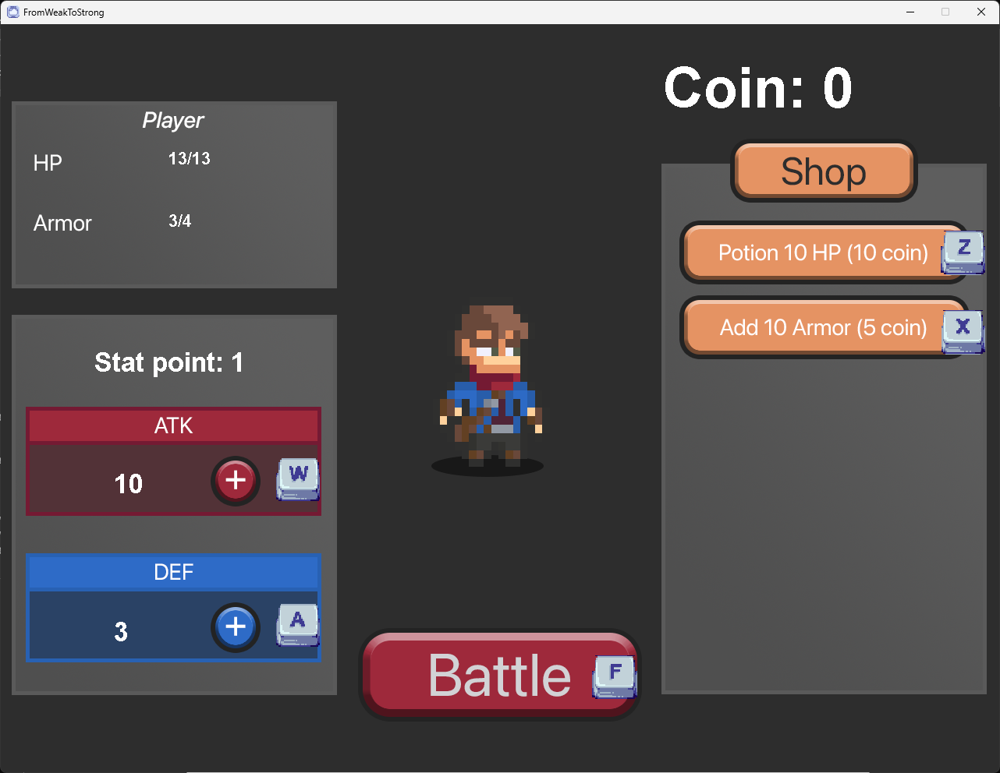
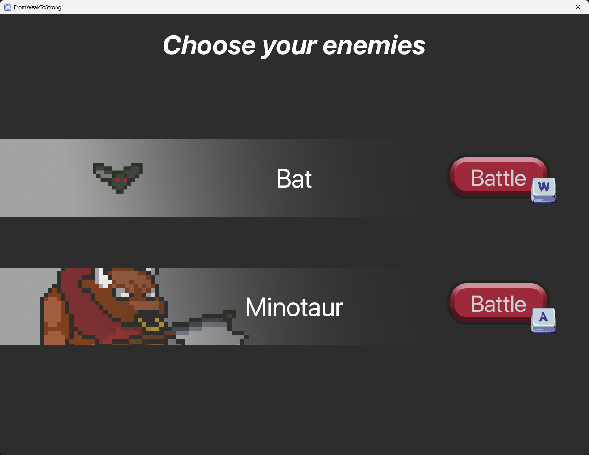
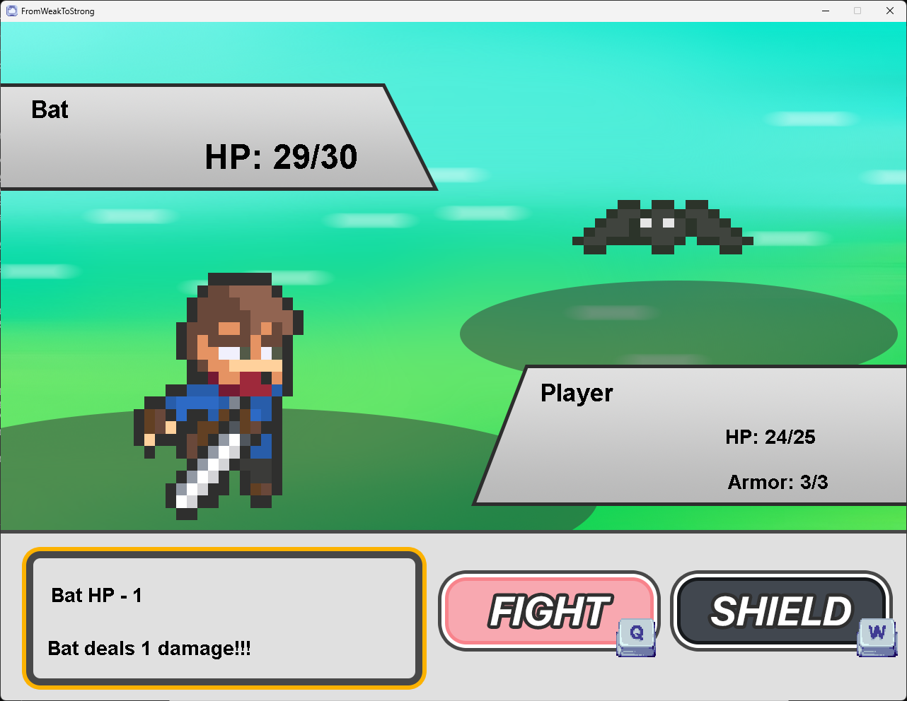

# FromWeakToStrong

## Prerequisites

- **Java Version**: This project is developed in Java version 21.0.1. You will need to have Java 21.0.1 or a compatible version installed on your system to run the project.

## Latest Release
[Release v0.0.1](https://github.com/nonnnz/OOP-Game-Final/releases/tag/v0.0.1)

## Gameplay Screenshots

**Asset Credit:** Player and Monsters by Elthen from [elthen.itch.io](https://elthen.itch.io/)
