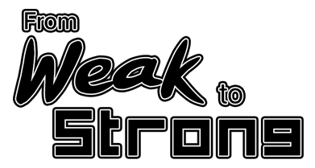
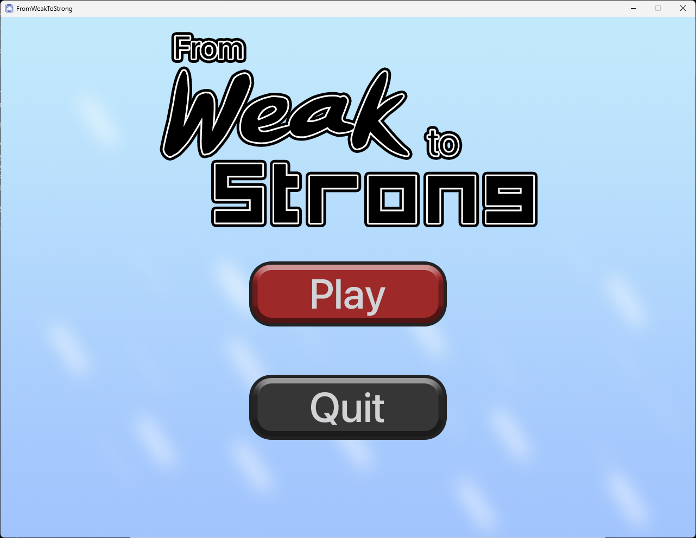
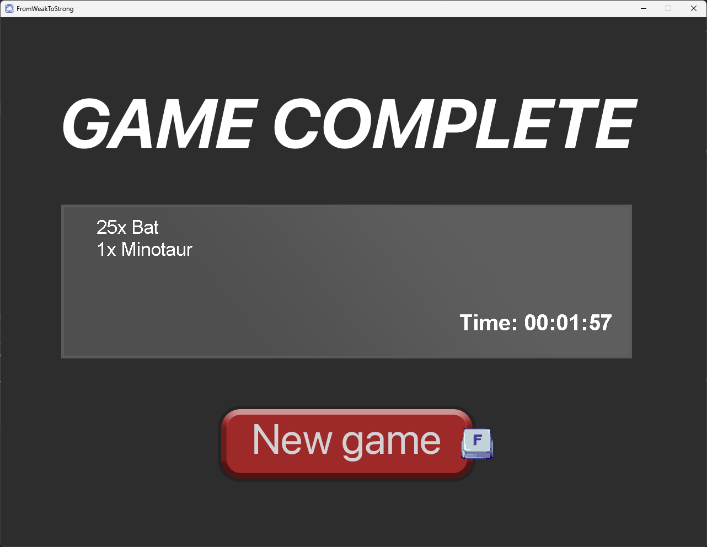

## FromWeakToStrong

## Prerequisites

- **Java Version**: This project is developed in Java version 21.0.1. You will need to have Java 21.0.1 or a compatible version installed on your system to run the project.

## Latest Release
[Release v0.0.1](https://github.com/nonnnz/OOP-Game-Final/releases/tag/v0.0.1)

## Description

In the game "From Weak to Strong," players take on the role of an ordinary person who must embark on a journey to confront two adversaries. The game follows a turn-based battle system, allowing players to attack and defend. However, unlike typical games, items cannot be used during battles. When defending, there is a random chance of success. If the defense is unsuccessful, the player's armor and HP will be reduced accordingly. If a player uses only defense repeatedly, they will be vulnerable to direct attacks. However, when a player's HP is reduced to a minimum, they have a chance to perform a critical hit, with the damage being randomly multiplied by their ATK.

When a player wins a battle, they receive money and stat points to upgrade their attributes and purchase items to increase their HP and armor. If a player loses, everything is reset, and the goal of the game is to finish as quickly as possible while being cautious about upgrading attributes.

## Gameplay Screenshots

## License

**Asset Credit:** Player and Monsters by Elthen from [elthen.itch.io](https://elthen.itch.io/)
